# Prototype Image Details

This document explains what each image demonstrates and how it fits into the POLARCONNECT workflow.

## 00 — Presentation visual
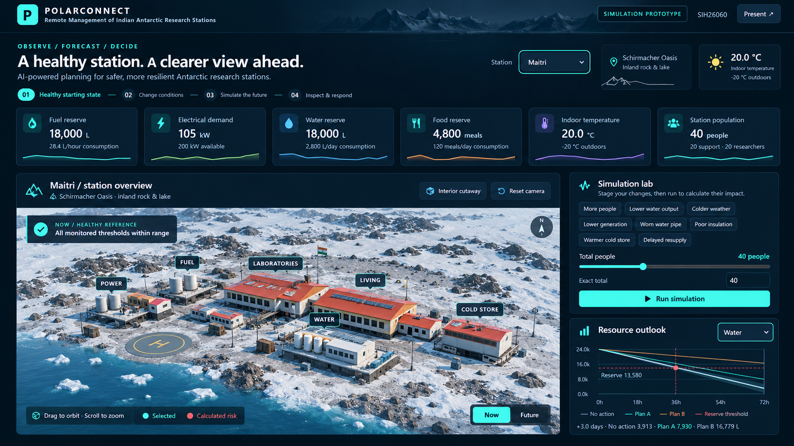

**File:** `00-polarconnect-presentation-visual.png`

A polished presentation image based on the project direction. Use this as a GitHub/social/presentation cover. It is **not** the exact prototype UI.

---

## 01 — Water Resource Forecast
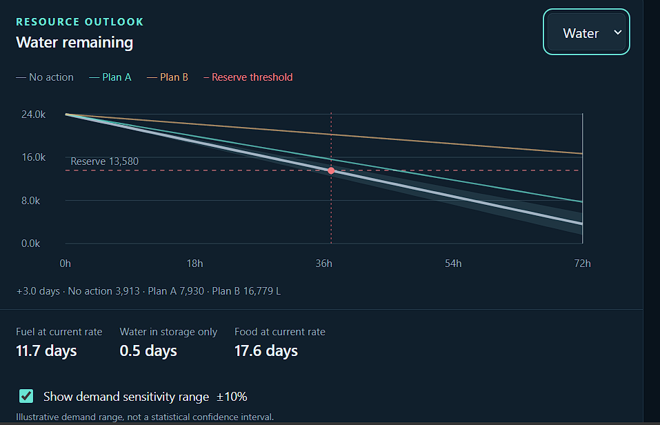

**Demonstrates:**
- selected resource: Water;
- No Action / Plan A / Plan B curves;
- reserve threshold;
- future-time cursor;
- demand sensitivity;
- days of fuel/water/food remaining.

**Project role:** converts raw resource values into future endurance and shows whether an intervention changes the outcome.

---

## 02 — Response Plans and Resupply
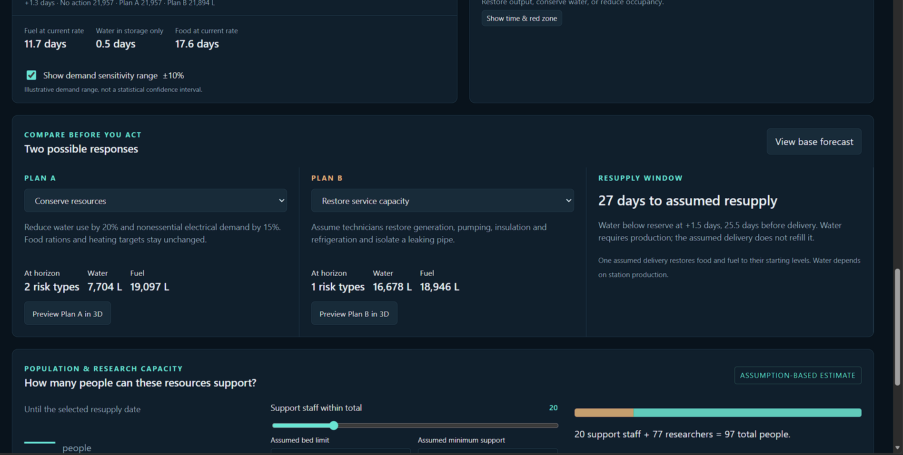

**Demonstrates:**
- Plan A: conserve resources;
- Plan B: restore service capacity;
- remaining water/fuel at the horizon;
- risk count;
- resupply timing;
- resource-supported population/research capacity.

**Project role:** lets a human compare consequences before taking action.

---

## 03 — Fuel Forecast and Predicted Risks
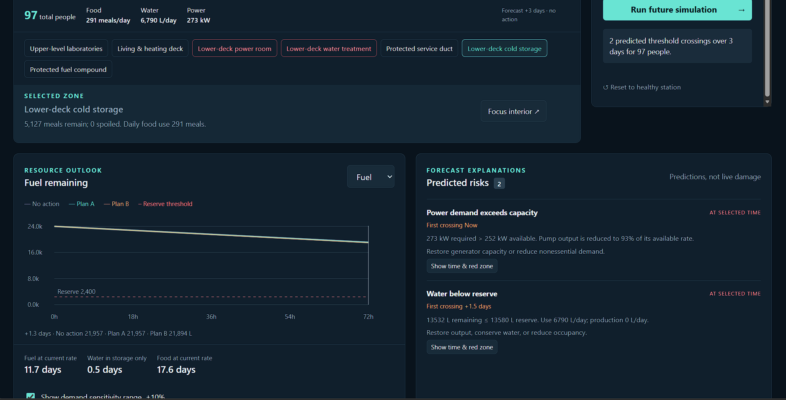

**Demonstrates:**
- future fuel curve;
- predicted power-capacity risk;
- predicted water-reserve risk;
- first threshold crossing;
- numerical explanation of why a risk exists.

**Project role:** root-cause-oriented alert explanation.

---

## 04 — Future Risk 3D View
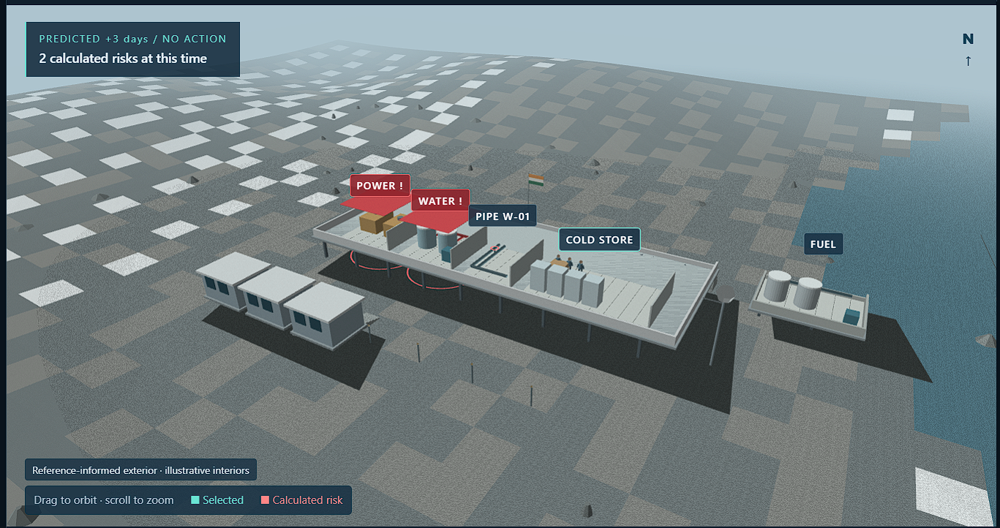

**Demonstrates:**
- future station state;
- red `POWER !` and `WATER !` labels;
- physical location of affected systems;
- predicted risk count.

**Project role:** turns a forecast into an understandable physical station view.

---

## 05 — Bharati Overview and Simulation Lab
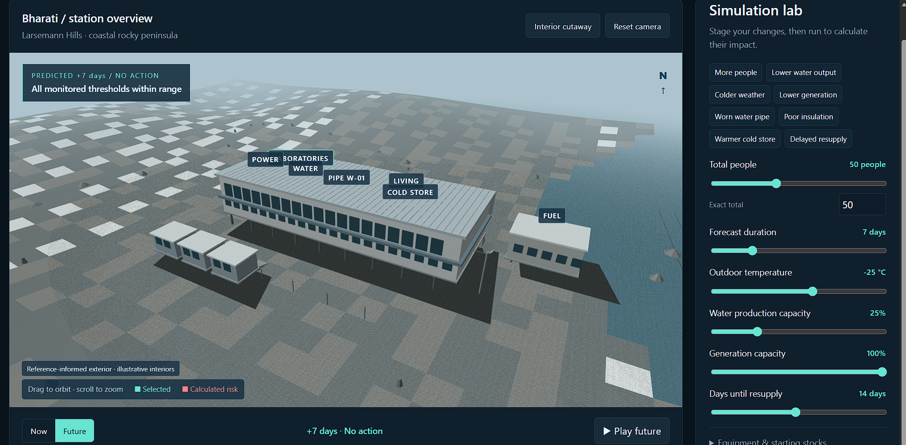

**Demonstrates:**
- station switch/profile;
- 3D station model;
- scenario buttons;
- population;
- forecast duration;
- temperature;
- water production;
- generation capacity;
- resupply delay.

**Project role:** central what-if simulation workspace.

---

## 06 — Bharati Healthy Dashboard
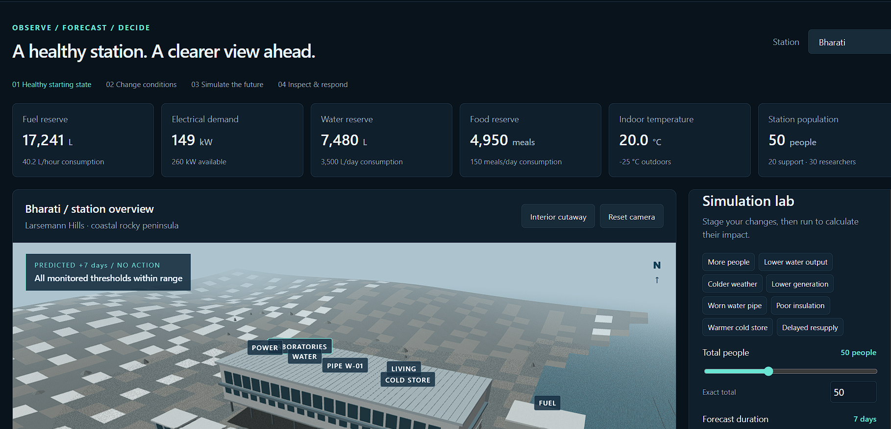

**Demonstrates:**
- healthy starting state;
- resource cards;
- station population;
- environmental state;
- station overview before problems are introduced.

**Project role:** establishes a trusted baseline before simulation.

---

## 07 — Maitri Interior Risk Inspection
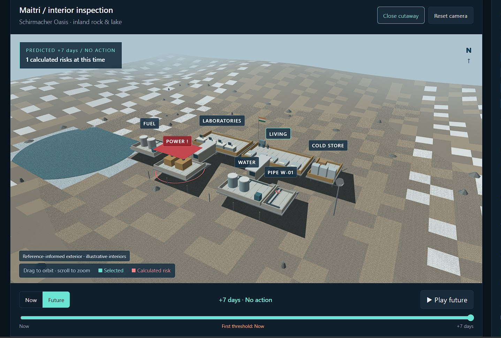

**Demonstrates:**
- cutaway/interior mode;
- equipment and zones;
- red power-risk area;
- future-time inspection.

**Project role:** helps an operator move from dashboard alert to equipment-area inspection.

---

## 08 — Healthy Reference 3D View
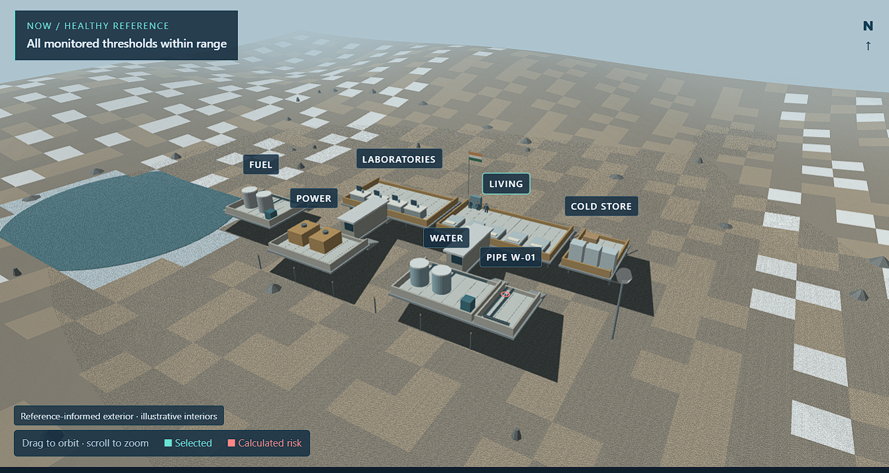

**Demonstrates:**
- healthy reference state;
- no calculated risk;
- labeled station zones.

**Project role:** visual baseline for comparison with future-risk views.

---

## 09 — Plan Comparison and Research Capacity
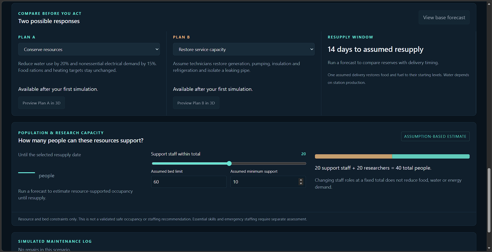

**Demonstrates:**
- plan comparison before action;
- resupply assumptions;
- support-staff slider;
- researcher/total population estimate;
- caveat that this is assumption-based.

**Project role:** connects resources and maintenance decisions to research capacity.

---

## 10 — Healthy State Resource Outlook
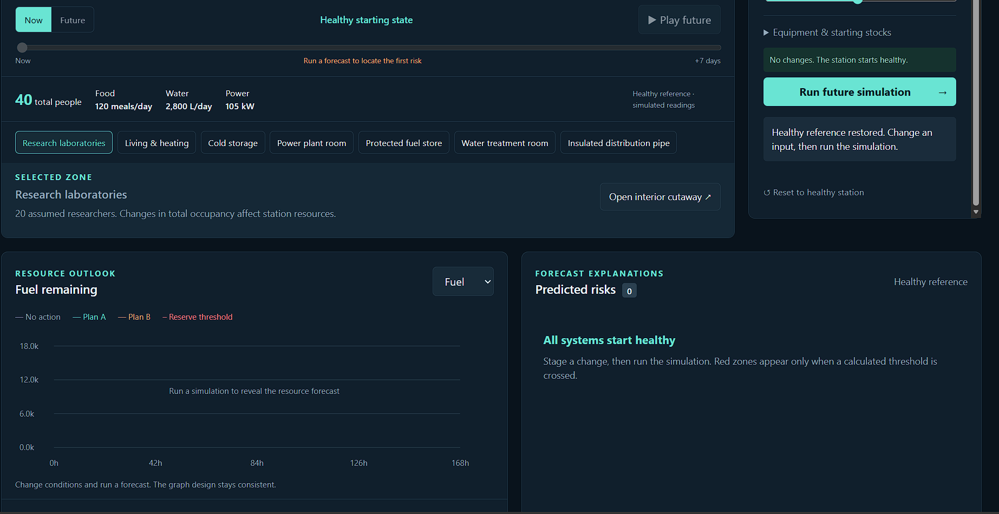

**Demonstrates:**
- Now/Future controls;
- population and demand;
- selected station zones;
- empty forecast graph before a simulation;
- zero predicted risks in healthy reference.

**Project role:** shows that the system does not invent alerts until a scenario is run and thresholds are actually crossed.

---

## 11 — Maitri Overview and Simulation Lab
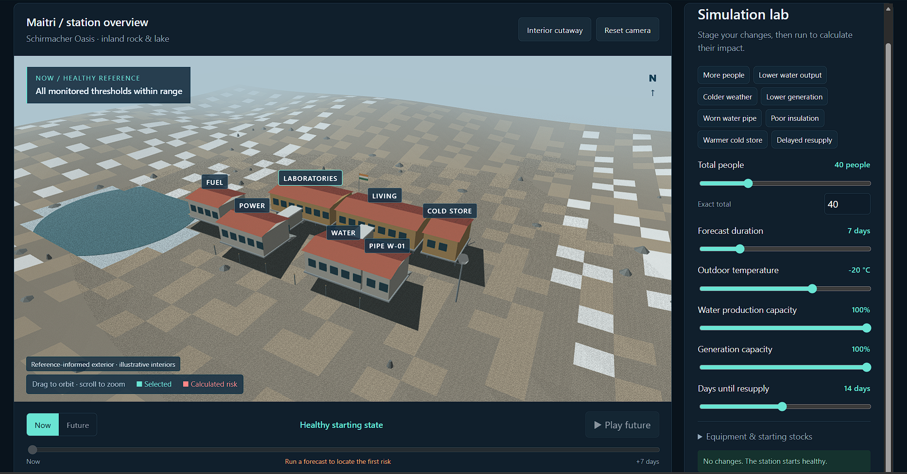

**Demonstrates:**
- Maitri station profile;
- healthy 3D view;
- station scenario controls;
- environmental and production sliders.

**Project role:** main operator interaction screen for Maitri.

---

## 12 — POLARCONNECT Main Dashboard
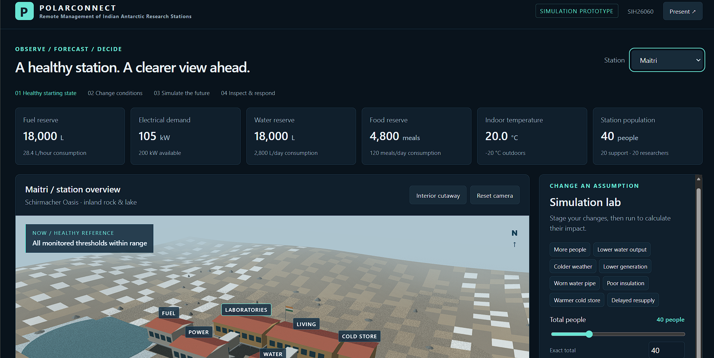

**Demonstrates:**
- project branding;
- workflow: Observe / Forecast / Decide;
- top-level resource indicators;
- station selection;
- station 3D view;
- Simulation Lab.

**Project role:** strongest screenshot for the real prototype landing/overview view.

---

## 13 — Food Resource Forecast
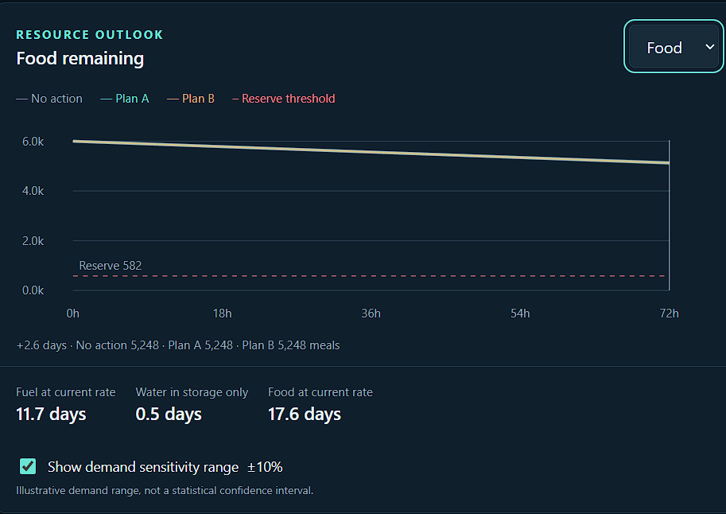

**Demonstrates:**
- food stock over time;
- reserve threshold;
- No Action / Plan A / Plan B comparison;
- cross-resource endurance summary.

**Project role:** confirms that the resource model is not limited to water/fuel.

---

## 14 — Bharati Interior Inspection
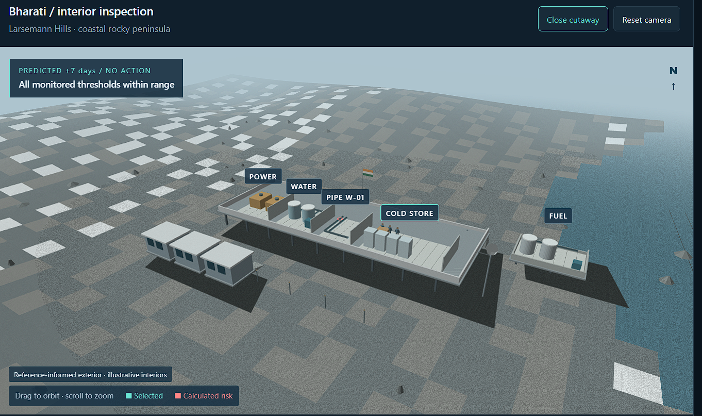

**Demonstrates:**
- interior cutaway;
- power, water, pipe, cold store and fuel systems;
- a future scenario with all thresholds within range.

**Project role:** shows detailed inspection even when no risk is present.

---

## 15 — Maintenance Log and Limitations
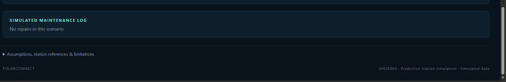

**Demonstrates:**
- simulated maintenance log;
- assumptions/references/limitations section;
- prototype footer/status.

**Project role:** provides traceability and makes simulation assumptions explicit.
